Pardon the mess this page is WIP; more docs for other configurations and assembly are in the works.

# How to assemble V4 LED kits

## V4 mini

### Getting to know your hardware

There are 3 main components of an IR LED kit; the mainboard, LEDs and wires.

### Mainboard

Below is the V4 mini mainboard with major features labeled.
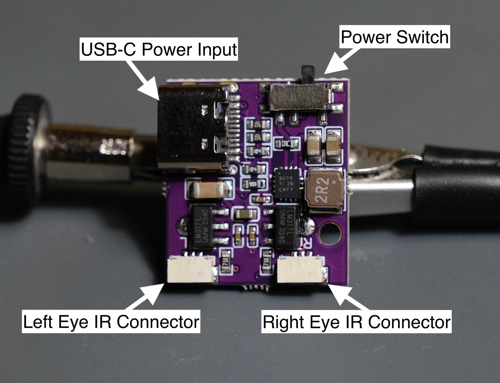
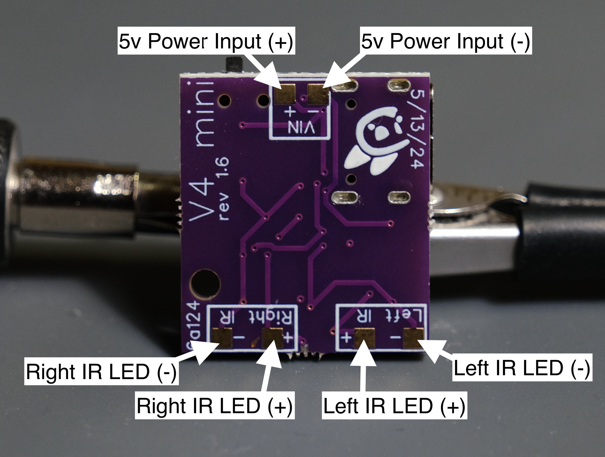

### LEDs

There are 2 different types of LED boards.
The one you should have more of are the "N" LEDs. N stands for Normal, these make up 3 of the LEDs per eye.
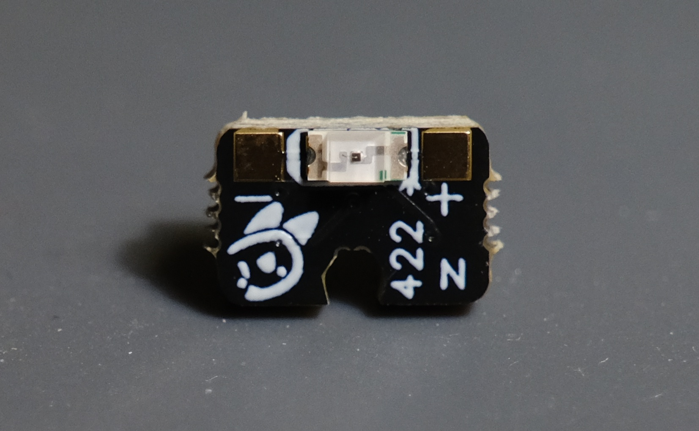
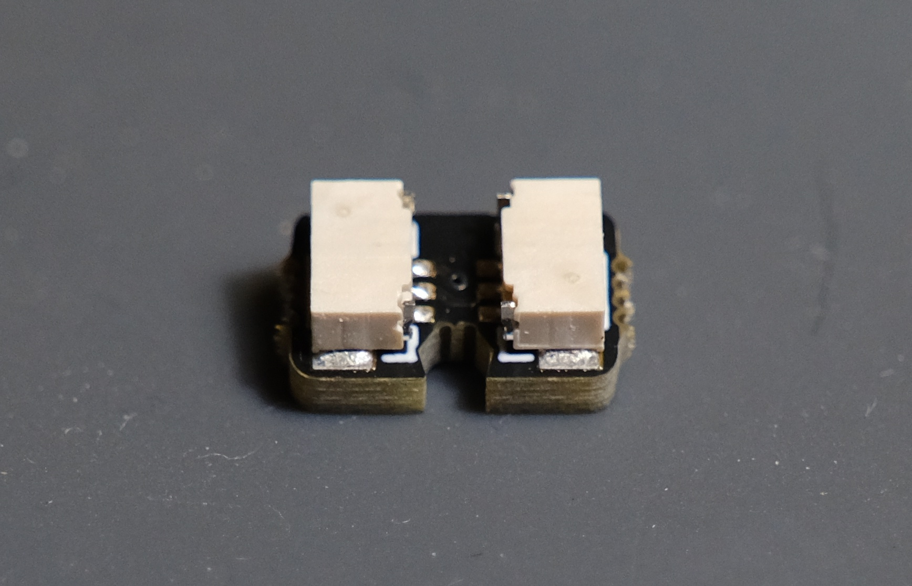

The second type is the "E" LEDs. E stands for End as these are put at the end of the LED strand.

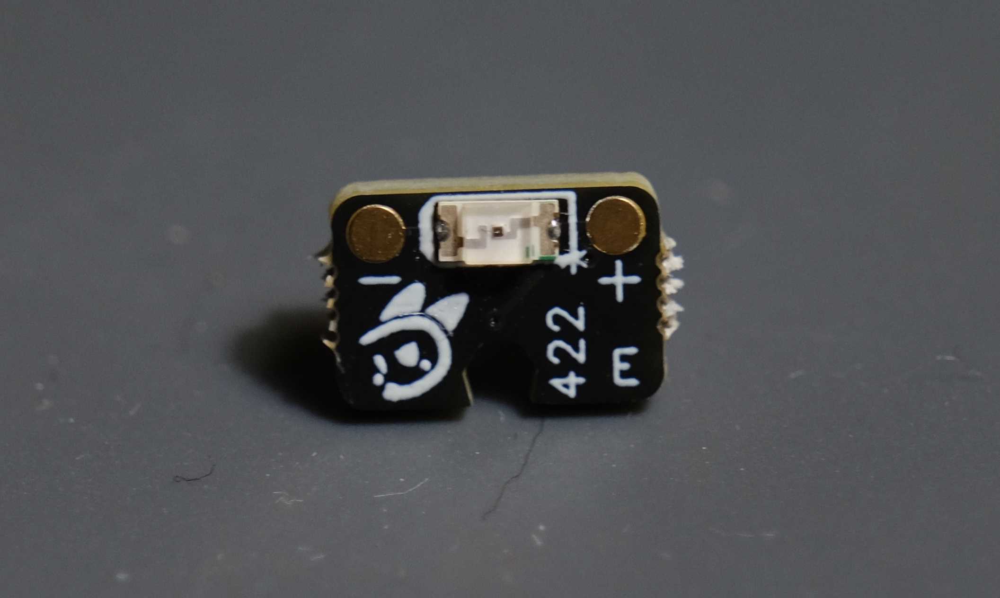
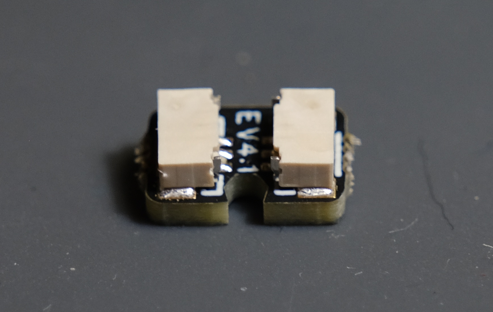

In future orders the "E" LEDs will be purple for easier distinction.
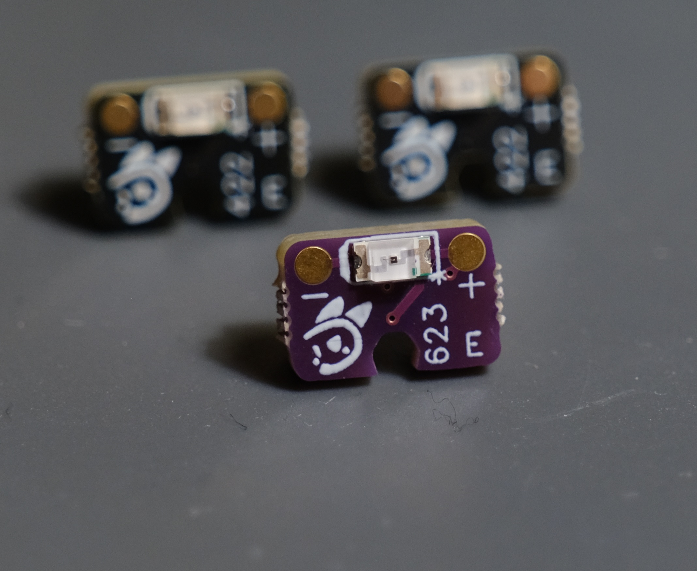

### Wires

The included wires are a bit special, they have 3 pins on the connectors but only 2 wires are attached.
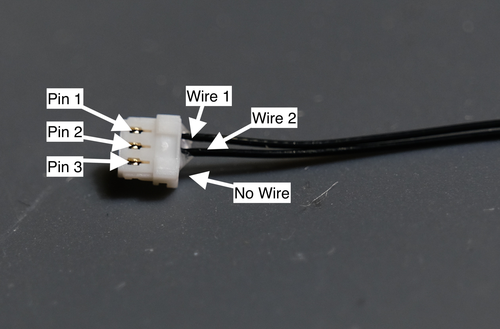

This distinction is crucial in assembling a kit as the wires need to go in a specific orientation outlined in the assembly picture which shows the pins without wires as dashes - - -.

### Wiring up V4 mini

Start by plugging in the long wires to the main board like shown.

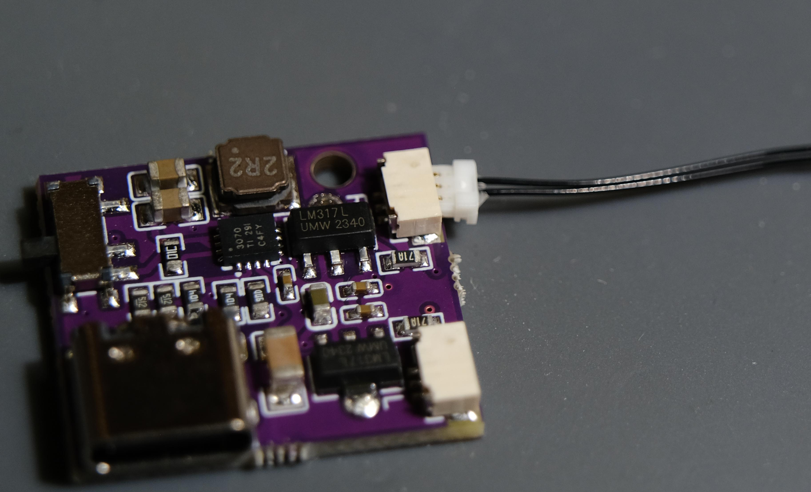
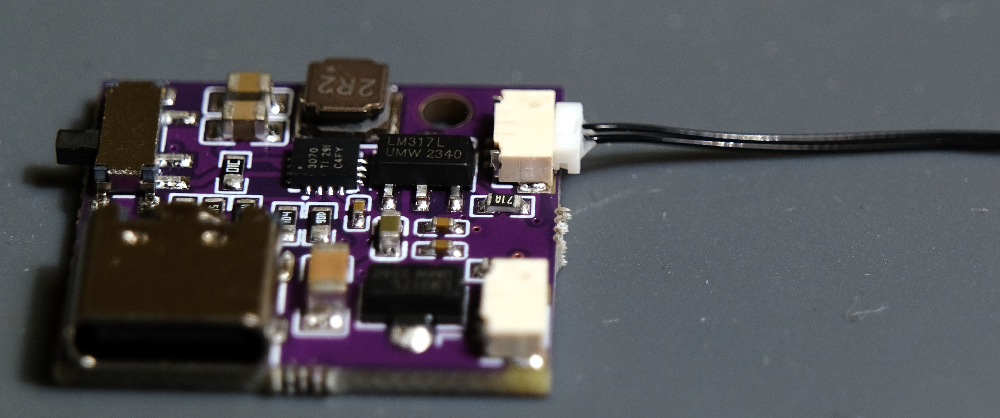

Then connect the wires to LEDs in the sequence:

`Mainboard -> N LED -> N LED -> N LED -> E LED`

You need to **pay very close attention** to the **orientation** of the wires so that the missing wire is facing the correct way. The following image shows a kit fully assembled:

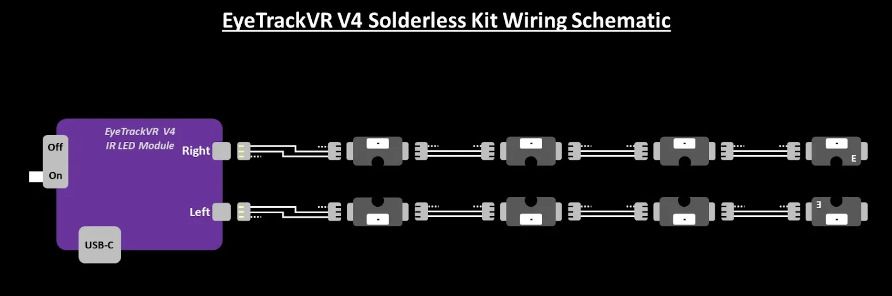

Here is an example of the right eye's LED strand.

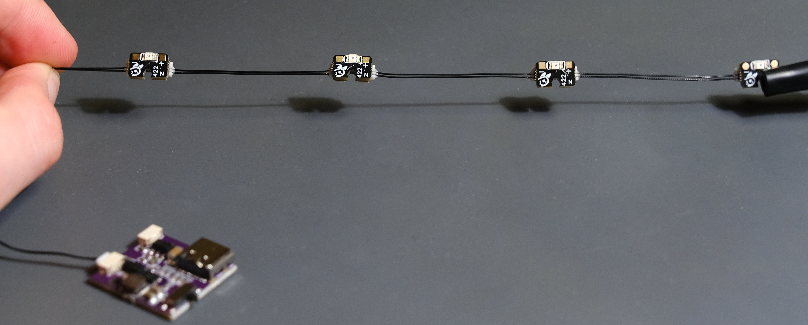

## V4 Lite

### Getting to know V4 Lite

V4 Lite is a soldering-required approach to LEDs. There are a few specific caveats to know before assembling and using this hardware.

1. The board must be supplied with 5V.
   - Other voltages may result in darker/non-functioning LEDs.

2. You must change resistors if you change from a single or dual eye setup to the other.
   - Not doing so will result in too dim of LEDs or extremely bright LEDs. Ensure you are always using the correct one for your application.

3. Shorts on the main board can result in damaged hardware, dangerously bright LEDs, or nonfunctioning hardware.
   - Please ensure there are no shorts (even very small stray solder strands) between any pins or solder joints on the main board or LEDs.

### Wiring up V4 Lite

First, decide if you want dual eye or single eye operation and pick the appropriate resistor.

**__Single Eye:__**
Use the 130ohm resistor marked with Black, Black, and Gold middle rings:

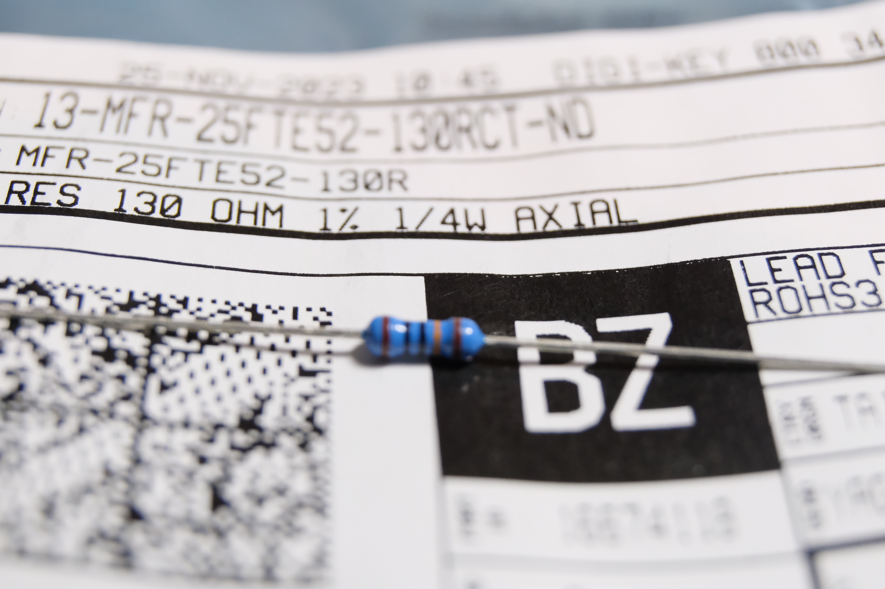

**__Dual Eye:__**
Use the 65ohm resistor marked with Yellow, White and Gold middle rings:

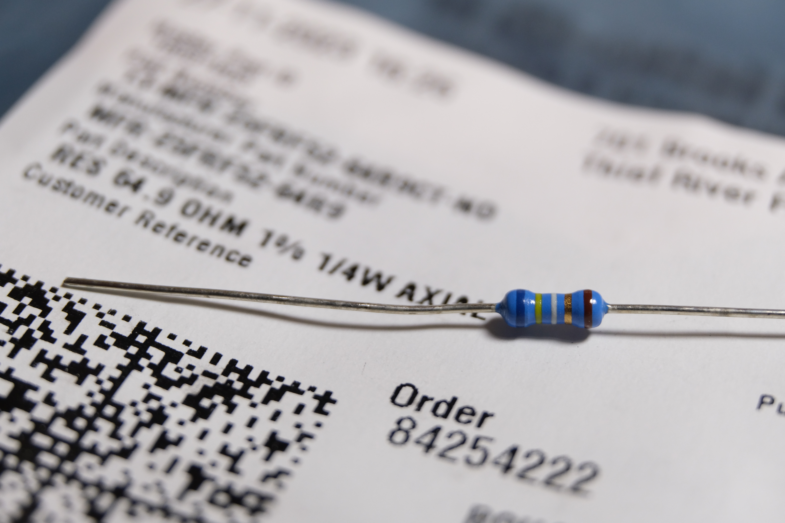

Now, solder the resistor on the board (any orientation), and then the black 3 pin voltage regulator (orientation matters, solder on the side with the white outline and have it fit in the outline's shape).

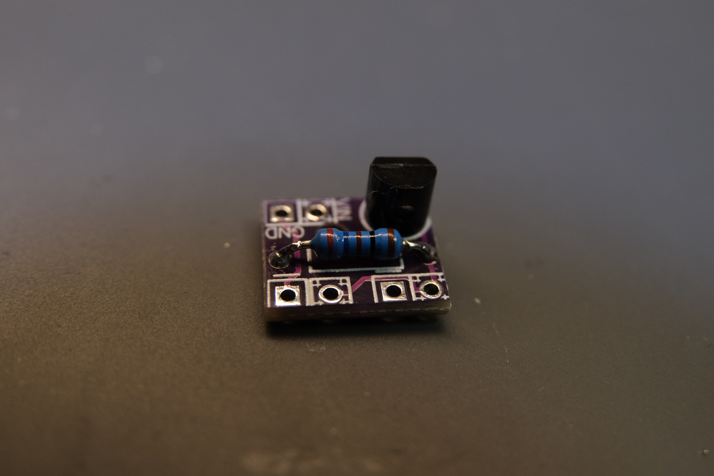

Now, wire up the LEDs like shown.

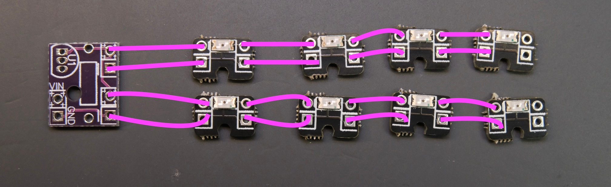
